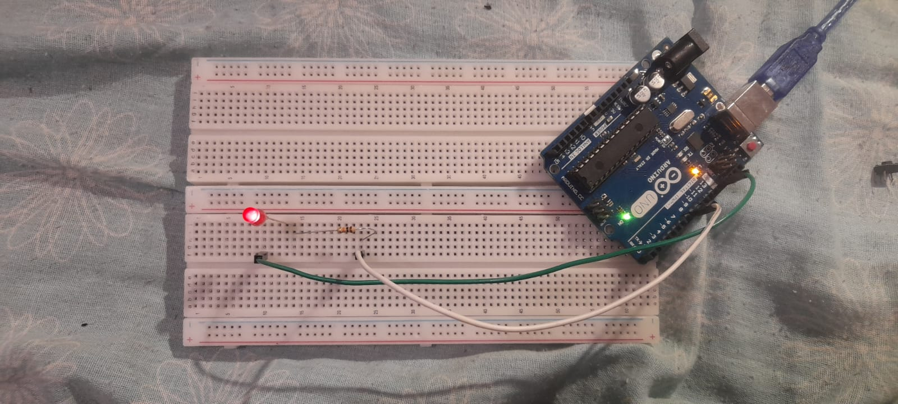

# ⚙ Blink Led Interno +  Simulando Blink Externo

## Parte I

### O que é um Blink em relação ao arduíno ?

É o código de exemplo mais básico (o "Hello, World" do Arduino) que tem como função fazer um LED piscar (ligar e desligar) em um intervalo de tempo predeterminado.

### E o led interno ?

Refere-se ao LED embutido que está presente na maioria das placas Arduino (como o Arduino Uno) e em outros microcontroladores. Este LED é conectado a um pino digital específico, geralmente o Pino 13, e é referenciado no código como LED_BUILTIN. Portanto, já com esses conhecimentos fixados vamos entender na prática o que é isso ! Com prints do código feito e registros da luz piscando. 

**Figura 1 – Código do Blink Interno**

**Figura 2 – Preview (Vídeo led interno)**

##### Clique na imagem acima e seja redirecionado, ao vídeo do led interno piscando !

## Parte II

### E o led externo?

O Blink Externo é o próximo passo após o teste interno e refere-se à prática de fazer um LED separado piscar, exigindo a montagem de um circuito externo à placa Arduino. É o primeiro passo para aprender a montar circuitos.

**Figura 3 – Código do Blink Externo**

##### [Clique aqui para ir ao arquivo do código!](ledexternocodigo.ino)

**Figura 4 – TinkerCad (Vídeo led OFF_BOARD)**

##### Clique na imagem acima e seja redirecionado, ao vídeo do led externo piscando !

**Figura 5 – Blink Externo ( foto )**

